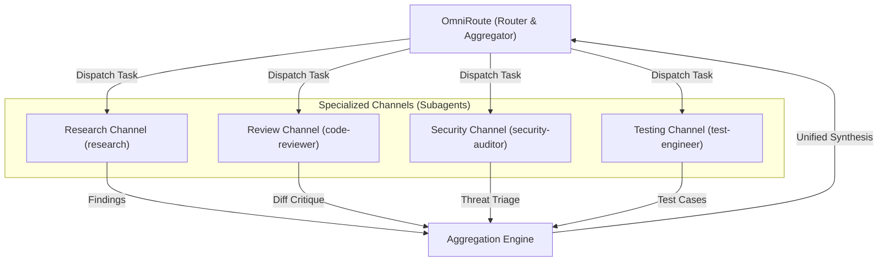

# OmniRoute — Multi-Channel Message Routing & Aggregation

OmniRoute is an agent orchestration and communication routing pattern. It governs how the primary agent delegates, monitors, and aggregates work across multiple specialized subagent channels and background tasks.

---

## 1. Core Routing Architecture

When handling complex or multi-faceted engineering tasks, OmniRoute routes work through specialized channels rather than running everything in a single linear thread:

---

## 2. Channel Directory & Dispatch Matrix

| Channel | Role | Typical Triggers | Tooling |
| :--- | :--- | :--- | :--- |
| **Research Channel** | Deep codebase or protocol exploration | Reverse engineering, USB descriptor inspection, traffic capture analysis | `invoke_subagent` (`TypeName: "research"`) |
| **Review Channel** | Quality & maintainability audit | Before finalizing PRs, multi-file changes, complexity checks | `invoke_subagent` (`TypeName: "code-reviewer"`) |
| **Security Channel** | Vulnerability & hardware safety audit | Input parsing validation, raw packet serialization, memory boundaries | `invoke_subagent` (`TypeName: "security-auditor"`) |
| **Testing Channel** | Test strategy & fixture generation | Mock transport fixtures, packet decoders, edge-case generation | `invoke_subagent` (`TypeName: "test-engineer"`) |

---

## 3. Routing Lifecycle & Reactive Wakeup

1. **Parallel Dispatch**: Use `invoke_subagent` to spawn one or more domain-specialized workers with precise, bounded prompts.
2. **No Busy-Polling**: Never run sleep/poll loops. OmniRoute relies on reactive wakeups: the environment notifies the router when a subagent completes or returns a message.
3. **Inter-Agent Communication**: Use `send_message` with `Recipient: <conversationId>` when intermediate steering or follow-up is necessary.

---

## 4. Multi-Channel Aggregation Protocol

Once messages return from active channels, OmniRoute aggregates them according to these rules:

1. **Conflict Resolution**: If two channels present divergent findings (e.g., Security identifies an unsafe packet structure that Research flagged as observed), Security bounds take precedence. Hardware safety is non-negotiable.
2. **Deduplication**: Collapse overlapping findings into a single consolidated summary.
3. **Actionable Synthesis**: Present results to the user structured by:
   - **Consensus Findings**: Verified facts agreed upon across channels.
   - **Open Questions / Uncertainties**: Items needing user decision or hardware verification.
   - **Recommended Next Steps**: The shortest, safest path forward.
