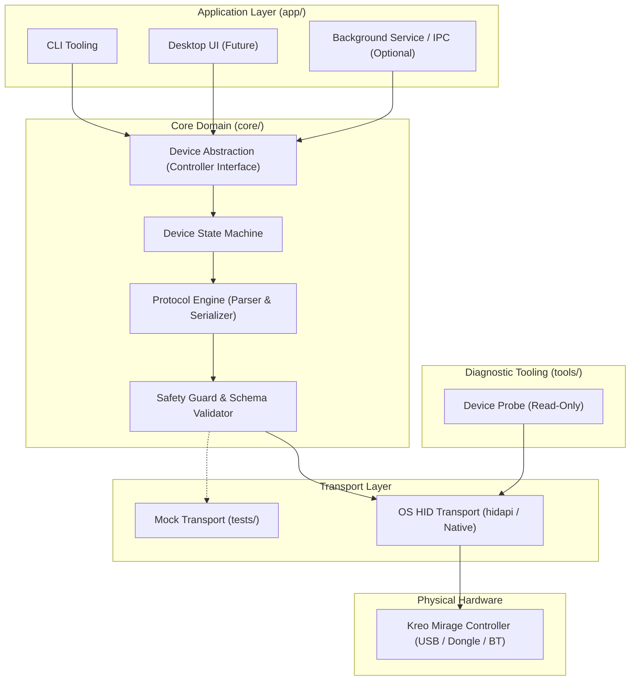

# COWL — System Architecture

This document describes the architectural design of COWL, defining module boundaries, component responsibilities, and safety mechanisms.

---

## 1. Architectural Overview

COWL follows a layered, decoupled architecture designed around safety, testability, and portability:

---

## 2. Component Responsibilities

### 2.1 Core Domain (`core/`)
The core domain contains all hardware abstraction and protocol logic, intentionally isolated from user interfaces and platform-specific windowing code.

- **Device Abstraction (HAL)**: Exposes high-level controller operations (e.g., `get_battery_status()`, `set_led_color(r, g, b)`, `set_rumble(left, right)`) without leaking raw HID report details to the application layer.
- **Protocol Engine**: Handles bidirectional transformation between high-level commands and raw binary HID reports (Input, Output, and Feature reports).
- **Safety Guard & Schema Validator**: The final gate before any byte buffer touches the transport layer. Every packet must conform to a strict schema of allowed Report IDs, payload lengths, and value ranges. Any unverified or out-of-bounds packet is rejected immediately with an error.
- **Device State Machine**: Tracks connection state (`Disconnected`, `Enumerating`, `Ready`, `Error`) and prevents command dispatch when the device is not in a ready state.

### 2.2 Transport Layer
Provides an abstraction over OS-specific USB and Bluetooth HID implementations.

- **Pluggable Interface**: Transport defines basic primitives: `open()`, `close()`, `read_report()`, `write_report()`, and `get_feature_report()`.
- **Mock Transport**: Allows unit and integration tests in [`tests/`](../tests/) to inject recorded packet sequences without needing physical hardware connected.
- **Live Transport**: Binds to standard cross-platform HID libraries (e.g., `hidapi` or platform native APIs).

### 2.3 Application Layer (`app/`)
Consumes the core domain to provide user interfaces:

- **CLI**: Fast, scriptable interface for viewing controller state and switching profiles.
- **Desktop UI**: Lightweight graphical interface (planned for Phase 5) for visual configuration.
- **Zero Business Logic**: The application layer contains no protocol logic or raw byte manipulation; it delegates entirely to `core/`.

### 2.4 Diagnostic Tooling (`tools/device-probe/`)
Independent, lightweight tools used during research and troubleshooting:

- **Safe Enumeration**: Queries connected devices, matching VID/PID without sending arbitrary writes.
- **Descriptor Extraction**: Dumps standard USB device, configuration, and HID report descriptors for analysis.

---

## 3. Structural Safety Guarantees

1. **No Direct Transport Access**: The application layer cannot communicate directly with the transport layer; all calls must flow through the protocol engine and the safety guard.
2. **Schema-Enforced Outputs**: Output and Feature reports cannot be constructed from raw untyped buffers in application code. Only strongly typed command builders with boundary assertions can generate dispatchable packets.
3. **Fail-Closed on Unrecognized Input**: If an incoming report from the device does not match expected layouts, it is logged for research but does not cause crashes or undefined state.
4. **Offline by Design**: No network sockets, analytics, or background telemetry services are permitted in any layer.
