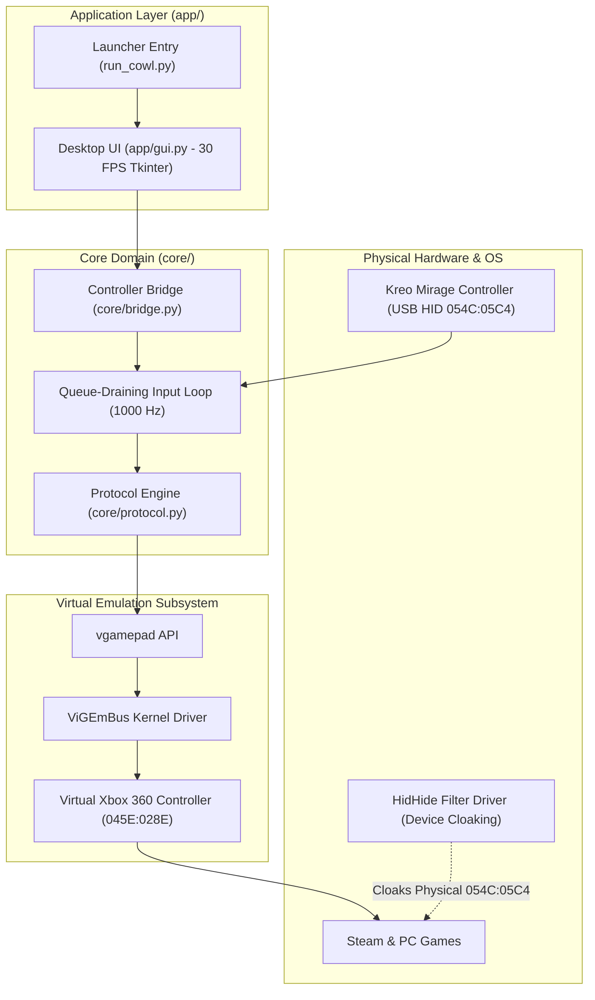

# COWL — System Architecture

This document describes the architectural design of COWL, defining module boundaries, component responsibilities, and safety mechanisms.

---

## 1. Architectural Overview

COWL follows a layered, decoupled architecture designed around safety, testability, and sub-millisecond input latency:

---

## 2. Component Responsibilities

### 2.1 Core Domain (`core/`)
The core domain contains all hardware abstraction, protocol parsing, and bridge translation logic, isolated from windowing code:

- **Protocol Engine (`core/protocol.py`)**:
  - Pure, stateless transformation between raw 64-byte DualShock 4 HID reports and normalized controller models.
  - Zero heap allocations in the critical path; static bitmask extraction and pre-cached DPAD tables.
  - Normalizes thumbstick axes to $[-1.0 \dots +1.0]$ and triggers to $[0.0 \dots 1.0]$.
- **Controller Bridge (`core/bridge.py`)**:
  - Drives the hardware lifecycle: connection detection, state notification, and virtual controller management.
  - **Ultra-Low Latency Pipeline**:
    - Decoupled from OS enumeration: `hid.enumerate()` is **never** called during active streaming.
    - **Queue Draining**: On every loop pass, the buffer is drained non-blockingly (`timeout=0`), discarding any stale backpressure and feeding only the freshest frame to ViGEmBus.
    - Yields `1ms` between idle frames, sustaining up to 1000 Hz polling with $<0.5\%$ CPU overhead.

### 2.2 Virtual Emulation Subsystem (ViGEmBus)
- Bridges the physical controller inputs to the Windows XInput subsystem using the industry-standard `ViGEmBus` driver.
- When enabled in COWL, a virtual `Xbox 360 Controller for Windows` (`045E:028E`) is dynamically plugged into the bus.
- When disabled, the virtual device is cleanly unplugged, allowing native PlayStation / DirectInput pass-through.

### 2.3 Application Layer (`app/`)
- **Desktop UI (`app/gui.py`)**:
  - Built with native Python & Tkinter: zero browser runtimes, zero Electron bloat, starts in $< 0.2$ seconds.
  - **Decoupled Diagnostics**: The UI updates on a steady 33ms timer (~30 FPS) reading cached state from the bridge. The UI thread never interrupts or adds queue pressure to the 1000 Hz input thread.
- **Root Launcher (`run_cowl.py`)**:
  - Single entry point: `python run_cowl.py`.

### 2.4 Cloaking Subsystem (HidHide)
- Eliminates the classic Windows "Double-Input / Ghost Controller" conflict.
- The physical `054C:05C4` device is cloaked from games and Steam, while whitelisted to the COWL Python process.
- Games see and bind strictly to the Virtual Xbox 360 Controller.

---

## 3. Structural Safety Guarantees

1. **Zero Firmware Flashing**: COWL operates exclusively within the controller's runtime configuration interfaces; it will never flash or alter device firmware.
2. **Schema-Enforced Outputs**: Output and Feature reports cannot be constructed from raw untyped buffers in application code. Only strongly typed command builders with boundary assertions can generate dispatchable packets.
3. **Fail-Closed on Unrecognized Input**: If an incoming report from the device does not match expected layouts, it is logged for research but does not cause crashes or undefined state.
4. **Offline by Design**: No network sockets, analytics, or background telemetry services are permitted in any layer.
